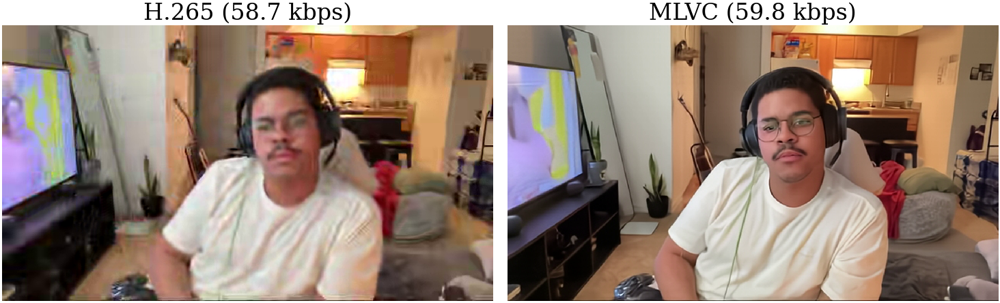
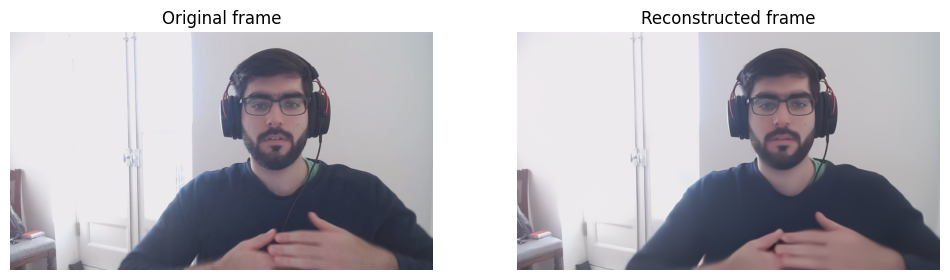

# Multi-platform Learned Video Codec (MLVC)

[](https://arxiv.org/abs/2606.28027)



**Neural video codec with real-time performance and hardware robustness across diverse consumer devices.**

MLVC achieves >70% MOS-based BD-rate improvement over hardware HEVC while averaging around 100 FPS for both encoding and decoding on commodity NPUs from Apple, Intel, and Qualcomm (540p).

This repository provides:
- **Pre-trained checkpoints** for inference
- **Training code:** Full pipeline for image and video model training (also works with [DCVC-RT](https://github.com/microsoft/DCVC))
- **Conversion tools:** Export to CoreML (Apple), ONNX for OpenVINO (Intel) and QNN (Qualcomm)
- **C++ entropy coder:** Production-ready, optimized for real-time deployment
- **Benchmarking tools:** BD-rate computation, RD curves, quality metrics, and anchors

## Installation

### Setup

1. Install uv: https://docs.astral.sh/uv/getting-started/installation/
2. Requires Python >=3.12, <3.14
3. Clone repository:
```bash
git clone https://github.com/microsoft/mlvc.git
cd mlvc
```
4. Install dependencies (choose your ONNX Runtime backend)
```bash
uv sync --extra onnxruntime              # CPU
uv sync --extra onnxruntime-gpu          # NVIDIA GPU
uv sync --extra onnxruntime-qnn          # Qualcomm NPU
uv sync --extra onnxruntime-openvino     # Intel NPU
uv sync --extra onnxruntime-windowsml    # Windows ML (GPU or NPU)
```
5. To produce actual bitstreams, you need to install the entropy coder (requires C++ compiler)
```bash
uv pip install packages/msrtc_rans
```
6. Install pre-commit hooks (for development)
```bash
uv run pre-commit install
```

## Minimal Example



See [`demo.ipynb`](video/notebooks/demo.ipynb) for a walkthrough.


## Models

| Model | Objective | Parameters | Weights | SHA-256 |
| --- | --- | ---: | --- | --- |
| MLVC | psnr | 18.3M | [mlvc-psnr-v1.ckpt](https://mlvideopub.blob.core.windows.net/mlvc/models/mlvc-psnr-v1.ckpt) | `834adaab680837c4106a9bb62e5778b3f13729b4fe6f751797e0747214f5cca1` |
| MLVC | perceptual | 18.3M | [mlvc-perceptual-v1.ckpt](https://mlvideopub.blob.core.windows.net/mlvc/models/mlvc-perceptual-v1.ckpt) | `0ba781769a12ae40548d3f6f92e56594510b926bf72ddb92717c7ebccde4723e` |
| MLVC-S | psnr | 5.4M | [mlvc-s-psnr-v1.ckpt](https://mlvideopub.blob.core.windows.net/mlvc/models/mlvc-s-psnr-v1.ckpt) | `1b86b757ddb115342293efb57719d6216c6ee2e459ae796ec41723b5c05ca896` |
| MLVC-S | perceptual | 5.4M | [mlvc-s-perceptual-v1.ckpt](https://mlvideopub.blob.core.windows.net/mlvc/models/mlvc-s-perceptual-v1.ckpt) | `cfe12eed07b00cdb98c0cd07136797f3b49e8d52f7b6bd3b81cf0a5312a4aa7c` |

**Note:** The checkpoints listed above were trained on OpenVid. The technical report used models trained on Vimeo.

## Training

Run commands from the `video/` directory.

### Directory layout

Training dataset paths are resolved relative to `--data_mount`.
Model checkpoints, auxiliary model files, anchors, and relative `--save_dir` paths are resolved relative to `--checkpoints_mount`.
Relative benchmark `config` paths such as `./test_cfg/...` are resolved from the working directory, so run the commands below from `video/`.

```text
~/mlvc/
├── data/                         # --data_mount ~/mlvc
│   ├── OpenVidHD/
│   └── VCD/
└── job-outputs/                  # --checkpoints_mount ~/mlvc/job-outputs
    ├── pretrained/
    ├── benchmark_test/
    │   └── anchor/
    └── checkpoints/
```

### Prepare training data

You should move all downloaded datasets to `~/mlvc/data`.

##### OpenVidHD

Download OpenVidHD data from [here](https://huggingface.co/datasets/nkp37/OpenVid-1M/tree/main/OpenVidHD) - see details and further steps in [BUILD_TRAIN_DATASET.md](video/BUILD_TRAIN_DATASET.md).

### Prepare validation and test data

##### HEVC

Follow instructions [here](https://stackoverflow.com/questions/66693808/where-can-i-get-test-sequences-for-hevc).

##### VCD

The original VCD dataset is available from the [VCD repository](https://github.com/microsoft/VCD).
Prepared versions used by this project are available at: [360p](https://mlvideopub.blob.core.windows.net/mlvc/datasets/VCD/640x360_30fps.tar), [540p](https://mlvideopub.blob.core.windows.net/mlvc/datasets/VCD/960x540_30fps.tar) and [720p](https://mlvideopub.blob.core.windows.net/mlvc/datasets/VCD/1280x720_30fps.tar).

Extract the required resolutions under:

```
~/mlvc/data/VCD/yuv/
├── 640x360_30fps/
├── 960x540_30fps/
└── 1280x720_30fps/
```

#### Anchors

Anchor files contain results from a reference codec and are used to calculate BD-rate.
We provide `intel_hw_hevc` anchors for VCD [360p](https://mlvideopub.blob.core.windows.net/mlvc/anchors/vcd/640x360_30fps/intel_hw_hevc-v1.json), [540p](https://mlvideopub.blob.core.windows.net/mlvc/anchors/vcd/960x540_30fps/intel_hw_hevc-v1.json), and [720p](https://mlvideopub.blob.core.windows.net/mlvc/anchors/vcd/1280x720_30fps/intel_hw_hevc-v1.json), and `DCVC-RT` anchors for [96-frame HEVC sequences](https://mlvideopub.blob.core.windows.net/mlvc/anchors/hevc/dcvcrt_with_iframe_metrics_recommended_yuv420.json) and [48-frame VCD-s1 360p sequences](https://mlvideopub.blob.core.windows.net/mlvc/anchors/vcd/640x360_30fps/dcvcrt_with_iframe_metrics_VCD_640x360_30fps_40s48f.json).
Keep the downloaded filenames and place the anchors under:

```text
~/mlvc/job-outputs/benchmark_test/anchor/
├── hevc/
└── vcd/
  ├── 640x360_30fps/
  ├── 960x540_30fps/
  └── 1280x720_30fps/
```

### Prepare auxiliary models

Auxiliary models are workflow-specific. You do not need to download all of them.

#### DCVC-RT I-frame model

Download the [`cvpr2025_image.pth.tar` checkpoint](https://1drv.ms/f/c/2866592d5c55df8c/Esu0KJ-I2kxCjEP565ARx_YB88i0UnR6XnODqFcvZs4LcA?e=by8CO8) provided by the [DCVC project](https://github.com/microsoft/DCVC), rename it to `DMCI-6.0.pth.tar`, and place it in `~/mlvc/job-outputs/pretrained/`.

#### LPIPS

LPIPS is required only for perceptual training or LPIPS evaluation.
Download the LPIPS VGG16 weights file [`vgg.pth`](https://github.com/richzhang/PerceptualSimilarity/blob/master/lpips/weights/v0.1/vgg.pth) from the [PerceptualSimilarity project](https://github.com/richzhang/PerceptualSimilarity), rename it to `lpips_vgg16.pth`, and place it in `~/mlvc/job-outputs/pretrained/`.

#### DeQA-Score

We provide experimental support for the [DeQA-Score](https://github.com/zhiyuanyou/DeQA-Score) no-reference metric which uses LLaMa2-7B.
Download the weights from their [HuggingFace page](https://huggingface.co/zhiyuanyou/DeQA-Score-Mix3) and place them in `~/mlvc/job-outputs/pretrained/DeQA-Score-Mix3`.

#### Face segmentation

FarL and RetinaFace are needed only to generate face segmentation masks or to calculate face-region metrics without precomputed masks.
Download the face detector [mobilenet0.25_Final.pth](https://github.com/biubug6/Pytorch_Retinaface) and face parser [face_parsing.farl.lapa.main_ema_136500_jit191.pt](https://github.com/FacePerceiver/facer/releases/download/models-v1/face_parsing.farl.lapa.main_ema_136500_jit191.pt) and move them to `~/mlvc/job-outputs/pretrained/checkpoints`.

### Train I-Frame Model

```bash
uv run train_image.py \
  --config configs/train_image-dcvcrt.yaml \
  --data_mount ~/mlvc \
  --checkpoints_mount ~/mlvc/job-outputs \
  --save_dir checkpoints/dmci
```

### Train P-Frame Model

```bash
uv run train_video.py \
  --config configs/train_video-mlvc.yaml \
  --data_mount ~/mlvc \
  --checkpoints_mount ~/mlvc/job-outputs \
  --save_dir checkpoints/mlvc
```

Perceptual fine-tuning configuration is shown in [train_video-mlvc-perceptual.yaml](video/configs/train_video-mlvc-perceptual.yaml), MLVC-S model configuration is shown in [train_video-mlvc_s.yaml](video/configs/train_video-mlvc_s.yaml).

## Evaluation

### Run Evaluation

To evaluate the pre-trained MLVC PSNR model, download [`mlvc-psnr-v1.ckpt`](https://mlvideopub.blob.core.windows.net/mlvc/models/mlvc-psnr-v1.ckpt) to `~/mlvc/job-outputs/pretrained/`, then run:

```bash
uv run train_video.py \
  --config configs/test_video-mlvc.yaml \
  --validate \
  --data_mount ~/mlvc \
  --checkpoints_mount ~/mlvc/job-outputs
```

### Supported Metrics

- **Distortion**: PSNR (Y/U/V/RGB), MS-SSIM, LPIPS, VIF, DeQA
- **Rate**: Bits per pixel (bpp), estimated and actual bitstream
- **Efficiency**: BD-rate against anchors (we provide H.265 anchor)

### Compute metrics for encoded videos

```bash
uv run compute_benchmark_metrics.py --config configs/compute_benchmark_metrics.yaml
```

### Compute optical flow, DeQA and texture complexity for training/validation frame sequences

```bash
uv run calculate_frame_sequence_metrics.py --config configs/dataset/calculate_frame_sequence_metrics.yaml
```

## Model conversion

Run commands from the `video/` directory.

### Prerequisites

Download and extract the [540p VCD data](#vcd), which is used during export validation and testing.

To convert a pre-trained model, download its checkpoint from the [Models](#models) table to `~/mlvc/job-outputs/pretrained/`, keeping its filename.

Copy [model_configs_example.yaml](video/conversion/_full_model/model_configs_example.yaml) to `video/conversion/_full_model/model_configs.yaml`. The template defines standard MLVC and MLVC-S entries with PSNR checkpoints selected by default. Update an entry's `weights_path` and `weights_version` to use its perceptual checkpoint.

Model conversion uses the directory layout above by default. If needed, override the job outputs and VCD data directories with `VIDEO_JOB_OUTPUTS_DIR` and `VIDEO_TEST_DATA_DIR`, or with `--job-outputs-dir` and `--test-data-dir`.

### Model export

As an example, export the standard MLVC PSNR model (`mlvc-psnr-v1.ckpt`) at the default `960x544` input size, using the default model format and target device for your platform:

```bash
uv run convert.py export --model-version dmc61sbr_reglu
```

More examples:

```bash
# Example 1: Export for different model formats and target devices
uv run convert.py export --model-version dmc61sbr_reglu --model-type coreml --target-device apple
uv run convert.py export --model-version dmc61sbr_reglu --model-type onnx --target-device intel
uv run convert.py export --model-version dmc61sbr_reglu --model-type onnx --target-device qualcomm
uv run convert.py export --model-version dmc61sbr_reglu --model-type onnx --target-device generic

# Example 2: Export at fixed input sizes (both dimensions must be multiples of 16)
uv run convert.py export --model-version dmc61sbr_reglu --model-width 640 --model-height 368
uv run convert.py export --model-version dmc61sbr_reglu --model-width 320 --model-height 192

# Example 3: Override the configured checkpoint and its version label
uv run convert.py export --model-version dmc61sbr_reglu \
  --weights-path /absolute/path/to/mlvc-perceptual-v1.ckpt \
  --weights-version perceptual_v1

# Example 4: Enable model benchmark after conversion
uv run convert.py export --model-version dmc61sbr_reglu --benchmark

# Other options
uv run convert.py export --help
```

### Model testing (examples for Apple devices)

The following examples validate, profile, benchmark, and evaluate the default `960x544` CoreML export. Adjust `--model-path` when using a different model, format, or input size. Full validation also requires the [540p anchor](#anchors).

```bash
# Example 1: Run conversion validation test
uv run convert.py test --model-path ./output/models/dmc61sbr_reglu-psnr_v1/coreml-apple/960x544 validate_conversion

# Example 2: Run profile
uv run convert.py test --model-path ./output/models/dmc61sbr_reglu-psnr_v1/coreml-apple/960x544 profile

# Example 3: Benchmark (uses NPU by default)
uv run convert.py test --model-path ./output/models/dmc61sbr_reglu-psnr_v1/coreml-apple/960x544 benchmark

# Example 4: Benchmark on GPU
uv run convert.py test --model-path ./output/models/dmc61sbr_reglu-psnr_v1/coreml-apple/960x544 --coreml-compute-units gpu benchmark

# Example 5: Run validation test (calculate BD-rate against anchor)
uv run convert.py test --model-path ./output/models/dmc61sbr_reglu-psnr_v1/coreml-apple/960x544 run_validation_test

# Example 6: Run validation test and save MLVC bitstream and reconstructed YUV frames (for model debug data, add --save-debug-data)
uv run convert.py test --model-path ./output/models/dmc61sbr_reglu-psnr_v1/coreml-apple/960x544 run_validation_test --save-output-data --save-yuv
```

### Model bundles

Model bundles package the configured model at the default input sizes (`960x544`, `640x368`, `432x240`, and `320x192`) into a versioned output directory and `.tar` archive. These defaults require corresponding VCD clips at 540p, 360p, 240p, and 180p under `~/mlvc/data/VCD/yuv/`.

```bash
# Example 1: Prepare a CoreML bundle for Apple devices
uv run convert.py bundle --model-version dmc61sbr_reglu --mlvc-version v0.1 --model-type coreml --target-device apple

# Example 2: Reuse existing individual model exports
uv run convert.py bundle --model-version dmc61sbr_reglu --mlvc-version v0.1 --model-type coreml --target-device apple --skip-if-exists

# Example 3: Prepare ONNX bundles for different target devices
uv run convert.py bundle --model-version dmc61sbr_reglu --mlvc-version v0.1 --model-type onnx --target-device generic
uv run convert.py bundle --model-version dmc61sbr_reglu --mlvc-version v0.1 --model-type onnx --target-device intel
uv run convert.py bundle --model-version dmc61sbr_reglu --mlvc-version v0.1 --model-type onnx --target-device qualcomm

# Example 4: Prepare an MLVC-S perceptual CoreML bundle
uv run convert.py bundle --model-version dmc61sbr_mini_reglu --mlvc-version v0.1 \
  --weights-path pretrained/mlvc-s-perceptual-v1.ckpt \
  --weights-version perceptual_v1 \
  --model-type coreml --target-device apple

# Example 5: Test 640x368 from the model bundle
uv run convert.py test --model-path ./output/model_bundles/dmc61sbr_reglu-psnr_v1-coreml-apple-v0.1 --model-id 640x368 validate_conversion

# Other options
uv run convert.py bundle --help
```

### Development

#### Run unit tests

```bash
uv run python -m pytest tests/test_conversion.py --disable-warnings
```

## Citation

If you use this code in your research, please cite:

```bibtex
@misc{parnamaa2026mlvc,
  title={MLVC: Multi-platform Learned Video Codec for Real-World Deployment},
  author={Tanel P{\"a}rnamaa and Martin Lumiste and Ardi Loot and Evgenii Indenbom and Andrei Znobishchev and Ando Saabas},
  year={2026},
  eprint={2606.28027},
  archivePrefix={arXiv},
  url={https://arxiv.org/abs/2606.28027},
}
```

## Acknowledgments

- [DCVC-RT](https://github.com/microsoft/DCVC) was the starting point for MLVC development.
- Entropy coding implementation adapted from [ryg_rans](https://github.com/rygorous/ryg_rans).

## Contributing

This project welcomes contributions and suggestions.  Most contributions require you to agree to a
Contributor License Agreement (CLA) declaring that you have the right to, and actually do, grant us
the rights to use your contribution. For details, visit [Contributor License Agreements](https://cla.opensource.microsoft.com).

When you submit a pull request, a CLA bot will automatically determine whether you need to provide
a CLA and decorate the PR appropriately (e.g., status check, comment). Simply follow the instructions
provided by the bot. You will only need to do this once across all repos using our CLA.

This project has adopted the [Microsoft Open Source Code of Conduct](https://opensource.microsoft.com/codeofconduct/).
For more information see the [Code of Conduct FAQ](https://opensource.microsoft.com/codeofconduct/faq/) or
contact [opencode@microsoft.com](mailto:opencode@microsoft.com) with any additional questions or comments.

## Trademarks

This project may contain trademarks or logos for projects, products, or services. Authorized use of Microsoft
trademarks or logos is subject to and must follow
[Microsoft's Trademark & Brand Guidelines](https://www.microsoft.com/legal/intellectualproperty/trademarks/usage/general).
Use of Microsoft trademarks or logos in modified versions of this project must not cause confusion or imply Microsoft sponsorship.
Any use of third-party trademarks or logos are subject to those third-party's policies.
